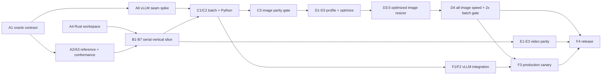

# qwen-mm implementation roadmap

Status: Proposed

Last updated: 2026-08-13

This roadmap turns the architecture in [DESIGN.md](DESIGN.md) and the first
measurement in [BENCHMARK.md](BENCHMARK.md) into dependency-ordered work with
explicit correctness, performance, and production gates.

## End state

The project is complete when a clean checkout can:

1. Load pinned Qwen3-VL and Qwen3.5 processor profiles without network access.
2. Accept structured conversations plus encoded images, caller-owned RGB data,
   and caller-supplied video frames in one native batch operation, with one
   pinned encoded-video adapter layered outside the core.
3. Produce the complete official processor output contract for the declared
   input envelope, with exact metadata and visual tensors that satisfy the
   versioned numerical contract.
4. Demonstrate parity against the pinned official composed path, not merely
   against an isolated resize or tokenizer implementation.
5. Demonstrate a repeatable, statistically supported speedup on both ARM and
   x86 CPU hosts while satisfying the versioned output contract and using the
   same thread budget.
6. Feed the prepared data into a pinned vLLM integration without falling back
   to Hugging Face or Qwen VL Utils, and improve an admission-bound direct
   `AsyncLLM` workload.
7. Ship reproducible Python wheels, a Rust API, compatibility manifests,
   conformance reports, and benchmark reports.

The image path reaches a useful release before encoded video support. Video is
still part of the final completion gate. Arrow/Ray support is a follow-on unless
a real training workload makes it the chosen production integration.

## Starting point

The repository is pre-implementation: there is no Cargo workspace or Rust
source yet. The pinned Python lock and 24 deterministic JPEG fixtures verify
locally, and one stored Mac mini M4 result exists.

| Pinned profile | `image1` median | `image24` median | `image24` output |
| --- | ---: | ---: | ---: |
| Qwen3-VL-8B-Instruct | 9.025 ms | 221.969 ms | 432 MiB `float32` |
| Qwen3.5-9B | 8.978 ms | 223.082 ms | 432 MiB `float32` |

This is a good directional baseline, but Milestone 0 is not fully closed. The
reference harness currently has no golden-array exporter or differential
comparator, signs only the first measured output, omits `mm_token_type_ids`,
and covers one homogeneous image shape on one host.

The review also found four contract issues that must be resolved before Rust
processing begins:

- The authoritative behavior is the *composition* of chat rendering, Qwen VL
  Utils, and the Hugging Face processor. None is a sufficient oracle alone.
- Both pinned profiles share the same visual configuration and pixel outputs;
  their present differences are tokenizer and chat-template behavior. They use
  one visual implementation with two explicit text/profile test suites.
- The official path returns `attention_mask` and `mm_token_type_ids`, which the
  draft `PreparedBatch` omits. Its NumPy metadata is `int64`, not the proposed
  `int32`.
- Pinned `qwen-vl-utils==0.0.14` does not explicitly apply EXIF transpose,
  despite the current design and benchmark language saying that it orients
  images. Pinned parity must preserve observed behavior.
- vLLM's `image_embeds` path represents post-vision-encoder embeddings, not
  prepared pixels. `qwen-mm` needs a registered multimodal processor or a small
  upstreamable prepared-pixel seam; it cannot simply relabel `pixel_values` as
  embeddings.

## Compatibility and parity contract

### The release oracle

For encoded media and structured messages, the release oracle is exactly:

1. A pinned model revision and hashed tokenizer, template, and processor assets.
2. `AutoProcessor.apply_chat_template(...)` from that revision.
3. `qwen_vl_utils.process_vision_info(...)` with the model's image patch size,
   video kwargs, and video metadata enabled.
4. The pinned Transformers `Qwen3VLProcessor` with `do_resize=False`,
   `do_sample_frames=False` where applicable, padding enabled, and NumPy output.

The current profiles are:

- `Qwen/Qwen3-VL-8B-Instruct@0c351dd01ed87e9c1b53cbc748cba10e6187ff3b`
- `Qwen/Qwen3.5-9B@c202236235762e1c871ad0ccb60c8ee5ba337b9a`
- Transformers 5.14.1, Tokenizers 0.22.2, and Qwen VL Utils 0.0.14

Direct Hugging Face processing with `do_resize=True` is a diagnostic comparison,
not the compatibility oracle, because it is not the model-card path measured by
the baseline.

This distinction changes real outputs. With the pinned patch size of 16, Qwen
VL Utils applies an effective default minimum of 4,096 image pixels; the model
processor configuration says 65,536, but that resize policy is bypassed by
`do_resize=False`. The composed output, including such quirks, wins.

Each compatibility profile records package and relevant source hashes, resolved
processor classes, model artifact hashes, codec versions, platform, and all
behavior-changing environment variables. An upstream upgrade creates a new
profile and corpus; it never silently overwrites an existing one.

### Public parity outputs

The Python parity API mirrors the official conditional key set and dtypes:

```text
PreparedBatch
├── input_ids:            int64 [batch, sequence]
├── attention_mask:       int64 [batch, sequence]
├── mm_token_type_ids:    int64 [batch, sequence]
├── pixel_values:         float32 [image_patches, patch_width]
├── image_grid_thw:       int64 [images, 3]
├── pixel_values_videos:  float32 [video_patches, patch_width]   (when present)
├── video_grid_thw:       int64 [videos, 3]                      (when present)
└── video metadata and adapter replacement ranges                (when required)
```

The Rust core may use ragged text plus offsets internally, but the parity adapter
materializes the official padded arrays. Compact integer and `bf16` outputs are
separate opt-in modes and are never used to establish the parity or headline
performance claim.

The allocating API is backed by a two-phase interface:

```text
plan_batch(requests) -> BatchPlan + exact required capacities
execute_plan_into(plan, destinations) -> PreparedBatchView
prepare_batch(requests) -> allocating convenience wrapper
```

This makes allocation size, overflow behavior, caller-owned storage, and output
ordering explicit before parallel execution begins. A processor instance owns a
bounded thread pool; it does not silently use Rayon's global pool inside a
PyTorch or vLLM process.

### Comparison policy

| Field or stage | Required comparison |
| --- | --- |
| Rendered and expanded prompts | Exact UTF-8 bytes |
| IDs, masks, modality IDs, grids, offsets, placeholder counts, frame indices | Exact values and order |
| Adapter-visible shapes, dtypes, and strides | Exact |
| Caller-owned RGB and lossless prepared RGB | Exact bytes |
| Official Pillow vs candidate still-image resized RGB8 | Per-occurrence, per-channel quality gates from [`qwen-mm-still-image-resize-v2`](docs/image-resize-contract-v2.md); exact no-op, constant, primary, and channel invariants |
| Normalize and patchify from identical candidate RGB | `rtol=0`, `atol<=1e-6`, plus ULP report |
| Encoded JPEG/WebP end-to-end still-image pixels | May differ only as implied by a passing v2 resized-RGB8 comparison; no additional downstream error |
| Video resize and final video tensors | Unchanged v1 comparison rules |
| Invalid input | Same valid/invalid outcome and stable typed error category |

Pixel mismatch reports include maximum absolute and ULP error, RMSE,
percentiles, count over threshold, and the first differing patch/channel
coordinate. A hash alone is not a numerical parity result. Tolerances are fixed
by the oracle work before evaluating an optimized candidate and cannot be
widened to make an implementation pass.

Parity-mode quirks are intentional. Python ties-to-even rounding, the observed
EXIF behavior, Qwen3.5 template whitespace/thinking behavior, media ordering,
and the raw-frame video factor behavior all receive explicit fixtures. Cleaner
or more permissive semantics must use a named non-parity mode.

## Performance contract

The headline CPU boundary remains the current one: in-memory encoded bytes plus
structured messages to fully materialized NumPy arrays. Reference and candidate
must use identical input bytes, messages, output keys, `float32`/`int64` dtypes,
model profiles, warm state, and total thread budget.

The release suite includes:

| Case | Purpose |
| --- | --- |
| `text_short`, `text_long` | Tokenizer and binding regression guards |
| `jpeg1_offgrid` | Current single 1023x767 JPEG |
| `jpeg24_one_request` | Current many-visual headline case |
| `jpeg24_requests` | 24 independent one-image requests in one native batch |
| `ragged24` | Mixed dimensions, aspect ratios, JPEG, PNG, and WebP |
| `aligned24` | Detect needless no-op resizing and copying |
| `minmax_boundaries` | Factor-32 and pixel-budget transition cases |
| `rgb24` | Caller-owned RGB with codec cost removed |
| `repeat24` | Cache disabled and enabled as separate results |
| `images_{1,4,16,32,64}` | Request and image scaling curves |
| `video_frames_{1,2,7,32}` | Temporal scaling after video parity lands |

Release measurements use five fresh processes per implementation, randomized
AB/BA order, at least 30 samples and five seconds per core case, fixed CPU
placement where available, and both one-thread and production-thread regimes.
Reports contain p50/p90 (and p99 only with enough samples), throughput, CPU time,
peak RSS, transient live bytes, allocation/copy counts, core utilization, and a
bootstrap 95% confidence interval for speedup. macOS ARM and Linux x86 results
remain separate.

"Much faster" has a hard meaning:

- All timed runs pass conformance immediately before and after measurement.
- The lower bound of the 95% speedup confidence interval is at least `2.0x` for
  both `jpeg24_one_request` and `ragged24` on controlled ARM and x86 hosts.
  Allocated native Modal x86 compute is eligible when captured CPU allocation,
  affinity/cgroups, repeatability, and runtime provenance satisfy the same
  protocol; provider identity alone neither qualifies nor disqualifies a run.
- On the current M4 baseline, the initial point targets are therefore below
  111.0 ms for Qwen3-VL and 111.6 ms for Qwen3.5 on `image24`.
- For every applicable shipping image coordinate, the lower bound of the 95%
  speedup confidence interval is strictly greater than `1.0`.
- Both text-only cases regress by no more than 5%.
- Parallel efficiency is at least 60% through eight physical cores on a
  many-image case.
- Transient live bytes, excluding the retained final output, are at most 50% of
  the official path, with no full `float32` CHW intermediate image.

Shared pull-request CI runs correctness and a benchmark smoke only. Dedicated
nightly hosts enforce performance; noisy shared runners do not block changes on
timing.

## Production proof: direct vLLM `AsyncLLM`

The vLLM integration starts with a seam spike because its internal processor API
is version-sensitive. The preferred path is a registered Qwen multimodal
processor that replaces the Hugging Face call and returns vLLM's normal prepared
pixel/grid fields while preserving its hashing, cache, placeholder, slicing, and
IPC behavior. It must not use `image_embeds`.

The final canary is a 2x2 experiment so processor speed is not confused with
event-loop scheduling:

| Processor | Synchronous raw admission | Renderer/client-thread offload |
| --- | --- | --- |
| Official Hugging Face path | A | B |
| `qwen-mm` | C | D |

The primary comparison is D versus A. C versus A isolates native processing;
D versus B isolates processing after admission scheduling is fixed.

Run each pinned model on one H100 80 GB with:

- 200 requests at concurrency 32;
- four deterministic, distinct 1024x1024 RGB images per request;
- multimodal cache disabled for the primary run;
- `max_tokens=1`, deterministic sampling, and fixed seeds;
- 20 warm-up requests and five process-level runs per cell; and
- identical model revision, container, engine arguments, CPU affinity, renderer
  worker count, and thread budget.

A second cache-on case uses one shared query image plus 31 distinct 448x448
document images per request.

Record raw-ready, preprocess-start, preprocess-complete, engine-submit, first
token, and completion timestamps; event-loop heartbeat gaps; external in-flight
tasks; EngineCore running/waiting counts; requests/images/patches per second;
CPU and GPU utilization; H2D bytes; and cache hits/misses.

The production gate requires:

- at least `2x` lower preprocess-to-submit p95;
- at least 80% lower maximum event-loop stall;
- a lower 95% confidence bound showing at least 10% higher total throughput or
  20% lower p95 time-to-first-token on the admission-bound case;
- zero request failures and no more than 2% text-only or warm-cache regression;
  and
- matching prepared tensors plus a curated deterministic top-token smoke set.

No-duplicate-work is a tested invariant. In the Rust path, fail-fast spies make
`process_vision_info`, Pillow resize, TorchVision resize, and the Hugging Face
processor raise if called. Request-scoped spans count decode, resize, normalize,
patchify, and tokenize stages. With cache off each media occurrence has exactly
one stage sequence; with cache on those counts equal cache misses. The NumPy data
pointer must equal the Torch tensor data pointer across `torch.from_numpy`.

If the pinned vLLM seam cannot safely carry prepared pixels, the fallback
production proof is a real PyTorch training collator: batch 16 distinct JPEGs in
one native call, feed the identical prepared arrays through the same Qwen model
forward, and gate on data-wait time, step throughput, GPU idle fraction, and
identical model inputs. The seam spike decides this early rather than at the end.

## Dependency-ordered work packages

### Phase A: freeze truth and high-risk seams

| ID | Depends on | Deliverable and exit gate |
| --- | --- | --- |
| A1 — Compatibility ADR | — | Record the exact invocation graph, supported message/media envelope, output keys/dtypes, profile fingerprints, quirks, error policy, and immutable pixel tolerances. Resolve EXIF and template/tool/thinking scope explicitly. |
| A2 — Golden exporter | A1 | Extend `reference/` to export rendered prompts, prepared RGB/frames, metadata, every final output key, errors, provenance, and small full-array goldens. Regeneration is deterministic. |
| A3 — Conformance corpus and comparator | A1, A2 | Add committed smoke goldens, compact rule fixtures, and seeded live differential cases with mismatch localization. Cover factor/min/max/aspect boundaries, modes/codecs, malformed media, interleaved/repeated visuals, both templates, and batch permutations. |
| A4 — Cargo and CI skeleton | — | Pin Rust, create `qwen-mm-core` and `qwen-mm-python`, and pass format, clippy, unit/doc tests on macOS ARM and Linux x86. |
| A5 — Paired benchmark v2 | A1, A2 | Give official and candidate paths the same runner, full-output verification, explicit threads, process repetitions, memory/allocation metrics, confidence intervals, and the workload matrix above. |
| A6 — vLLM seam spike | A1 | Pin a vLLM revision, prove the registered-processor/prepared-pixel hook with a tiny request, document cache/replacement requirements and async execution, and prove the official processor can be bypassed. If no safe hook exists, scope the minimal upstream change now. |

### Phase B: serial Rust vertical slice

| ID | Depends on | Deliverable and exit gate |
| --- | --- | --- |
| B1 — Profiles, types, and limits | A1, A4 | Load both local profiles and reject unknown hashes/configs. Define messages, visual references, complete outputs, resource limits, and typed errors. Public parity storage is `int64`/`float32`. |
| B2 — Tokenizer and chat rendering | A2, B1 | Use the Rust `tokenizers` crate and implement the declared Qwen3-VL/Qwen3.5 template surfaces. Rendered bytes, special tokens, padding, masks, modality IDs, generation/thinking options, and errors are exact. |
| B3 — Geometry and `smart_resize` | A3, B1 | Match exhaustive Python boundary tables, including ties-to-even rounding, min/max budgets, aspect ratio 200, explicit dimensions, and overflow behavior. |
| B4 — Raw-RGB normalize and patchify | A2, B1, B3 | From already prepared RGB, match normalization, still-image temporal duplication, permutation, flattening, grids, and patch-count invariants before decoding/resizing adds ambiguity. |
| B5 — Resize parity spike | A2, B3 | Compare candidate kernels with pinned Pillow for images and TorchVision bicubic+antialias for video. Select or implement kernels only after the frozen tolerance passes. |
| B6 — Decode and color semantics | A3, B5 | Land JPEG first, then PNG/WebP, raw strided RGB, grayscale/alpha/CMYK conversion, observed EXIF behavior, malformed input, and pixel-bomb limits. Prepared RGB passes the stage oracle. |
| B7 — Serial single-request image path | B2, B4, B6 | Combine visual planning, placeholder expansion, tokenization, pixels, and grids. One image and interleaved/repeated image cases pass both profiles without Python at runtime. |

### Phase C: batch and Python parity release

| ID | Depends on | Deliverable and exit gate |
| --- | --- | --- |
| C1 — Two-phase serial batch API | A6, B1, B7 | `plan_batch`, `execute_plan_into`, and `prepare_batch` handle heterogeneous requests, exact capacities, deterministic order, padding, overflow, and undersized destinations without partial writes. |
| C2 — PyO3/NumPy binding | C1 | One Python call handles the full batch, releases the GIL, performs no Python callback per visual, exposes official dtypes/strides, and transfers the large pixel allocation to NumPy without a copy. Ownership and failure lifetimes are tested. |
| C3 — Full image conformance gate | A3, C2 | Both profiles pass the entire declared text/image corpus, including every output key and error category. Publish the first conformance report. No speed claim is allowed before this gate. |

### Phase D: profile, optimize, and certify speed

| ID | Depends on | Deliverable and exit gate |
| --- | --- | --- |
| D1 — Native observability and profile | A5, C3 | Add request/media stage spans, allocation and buffer-lifetime counters, Python-call counters, and whole-operation flamegraphs. Publish a ranked bottleneck list on ARM and x86. |
| D2 — Deterministic bounded parallelism | D1 | Parallelize requests/visuals with an owned bounded pool. Outputs and errors are invariant at thread counts 1 through N; tokenizers/PyTorch/vLLM cannot oversubscribe it by default. |
| D3 — Profile-driven fusion and arenas | C1, D1 | Land scratch reuse, fused normalize/layout writes, and caller-owned buffers only where profiles justify them. Each isolated change reruns full conformance and documents removed buffers/copies. |
| D3.5 — Optimized still-image resizer | C3, D1 | Freeze the v2 neural-image quality envelope, measure maintained Rust-native resizers, and select one only if it passes exact structural/invariant checks and the fixed holdout/adversarial corpus. |
| D4 — Image performance certification | A5, C3, D2, D3, D3.5 | Run the complete controlled-host protocol and meet every CPU speed, regression, scaling, and transient-memory gate. Every shipping image coordinate must be statistically faster than official while the `image24` and `ragged24` headline batch gates remain `2x`. Publish raw JSON and a readable report beside correctness. |

### Phase E: temporal and encoded-video support

| ID | Depends on | Deliverable and exit gate |
| --- | --- | --- |
| E1 — Raw-frame temporal tensor path | A2, B4 | Caller-owned RGB frame sequences match temporal padding, patchification, ordering, grids, and odd/boundary frame counts without coupling core semantics to a decoder. |
| E2 — Sampling, metadata, and video placeholders | A3, B2, E1 | Match fps/nframes policy, indices, total-pixel budgets, timestamps, defaults, per-frame prompt construction, and the pinned raw-frame factor quirk. Capture all behavior-changing environment values. |
| E3 — Encoded-video adapter | E2 | Pin one maintained decoder/backend outside the core, pass canonical model-card videos and adversarial clips, and document platform/backend variance separately from core parity. |

### Phase F: production integration and release

| ID | Depends on | Deliverable and exit gate |
| --- | --- | --- |
| F1 — vLLM processor adapter | A6, C2, C3 | Map prepared pixels, grids, tokens, replacement ranges, cache keys, and field configuration into the pinned registered processor. Do not use post-encoder `image_embeds`. |
| F2 — No-fallback async smoke | D2, F1 | Run one deterministic real-model request while fail-fast spies prove zero HF/Qwen Utils fallback, pointer identity proves NumPy-to-Torch sharing, and preprocessing executes off the asyncio loop. |
| F3 — Production canary | D4, F2 | Implement and run the 2x2 direct `AsyncLLM` experiment, meet its admission and end-to-end gates, and publish traces/results. Keep `vllm serve` as a separate non-regression check because its admission path differs. |
| F4 — Hardening and distribution | D4, E3, F3 | Fuzz media/messages and resource limits; verify cancellation, integer overflow, cross-platform float/SIMD behavior, and wheel reproducibility; publish support/compatibility docs and one-command verification. |

## Execution order and stop/go gates



The first wave starts A1 and A4 in parallel, then starts A6 as soon as A1 closes.
A6 is deliberately early: a missing vLLM injection seam can change the batch
metadata contract. After A1, the reference and benchmark work proceeds in
parallel with the workspace and profile code.
Text and raw-RGB patchification can then proceed independently. Video work can
start after raw patchification while image batching and optimization continue.

The project stops and resolves the issue at these gates:

1. **A1:** no processing code before the oracle, supported envelope, dtypes,
   and tolerances are frozen.
2. **B5/D3.5:** no resizer dependency is accepted because it is fast; it first
   has to pass the versioned quality contract, exact invariants, and frozen
   stage corpus.
3. **C3:** no benchmark claim before complete image parity for both profiles.
4. **D1:** no speculative fusion before a whole-operation allocation/profile
   census identifies the actual bottleneck.
5. **D4:** no production claim before the same-output CPU suite proves `2x`.
6. **F2:** no vLLM benchmark before fail-fast tests prove duplicate processing
   is impossible.
7. **F4:** no final release until image, video, performance, and production
   reports are all reproducible from pinned manifests.

## Principal risks and mitigations

| Risk | Mitigation in the roadmap |
| --- | --- |
| Oracle drift or accidental double resize | Immutable profiles and exact invocation manifests; `do_resize=False` is asserted. |
| Pillow/TorchVision and Rust kernel disagreement | Versioned stage goldens and B5/D3.5 before dependency selection; the frozen still-image v2 quality gates and unchanged video-v1 tolerance cannot move afterward. |
| Python/Rust rounding differences | Exhaustive pure-rule fixtures, including half ties. |
| Qwen3.5 template complexity | Separate explicit text profile and full declared message-option corpus. |
| 432 MiB output multiplied by parallel scratch | Two-phase allocation, bounded pool, live-buffer counters, and transient-memory gate. |
| PyO3 lifetime or hidden copies | Ownership tests, data-pointer identity, and allocation spans. |
| Rayon/PyTorch/vLLM oversubscription | Processor-owned pool and equal-budget thread sweeps. |
| Native work still blocks asyncio | Explicit off-loop execution and heartbeat gate; releasing the GIL alone is insufficient. |
| vLLM API churn | Pin a revision and prove the seam in A6 before core output freeze. |
| Video backend nondeterminism | Raw frames are canonical; encoded decoding is a separately pinned adapter. |
| Malicious or enormous media | Checked arithmetic, configurable resource limits, typed errors, fuzzing, and pixel-bomb tests. |

## Deferred work

- Generic Hugging Face processor or arbitrary Jinja compatibility.
- URLs, network fetching, PIL-object compatibility, and arbitrary tensors in
  the Rust core.
- Multiple encoded-video backends.
- `bf16` or compact-int performance claims before the `float32`/`int64` parity
  release.
- Arrow/Ray adapters unless a selected production training workload requires
  them. They can start after C2 and reuse the caller-owned-buffer work in D3.
- Cross-request content caching until uncached correctness, ordering, and
  production cache-key behavior are proven.
